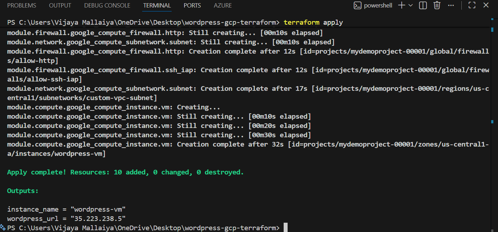
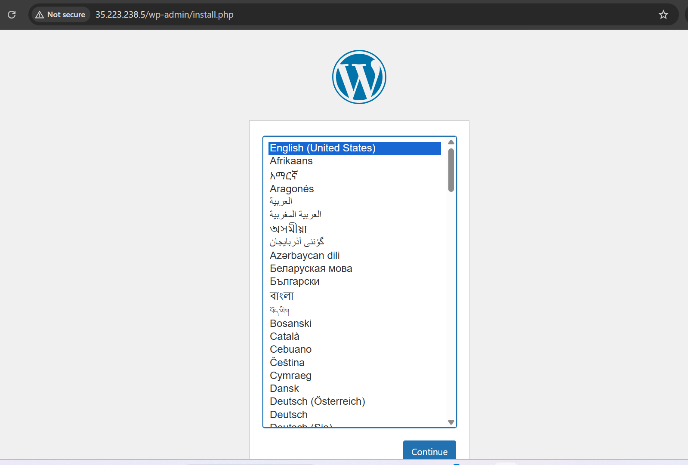
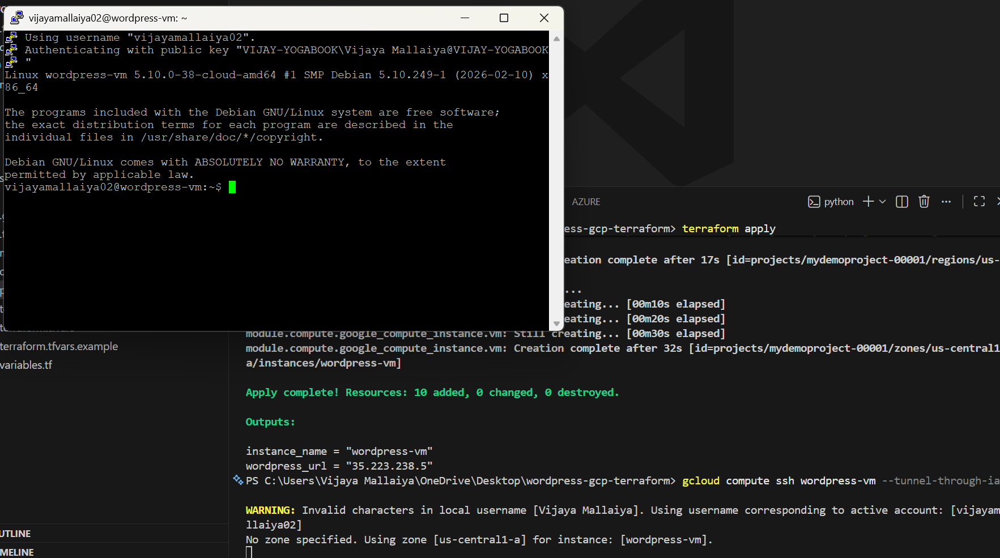
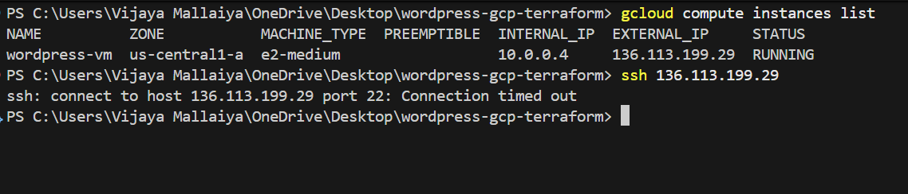
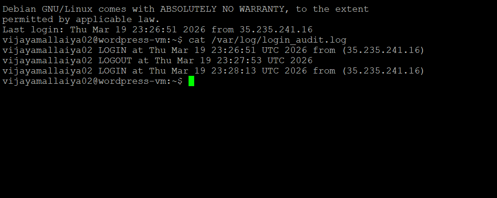

# Secure WordPress Deployment on GCP using Terraform

## Overview

This project provisions a secure WordPress deployment on Google Cloud Platform using Terraform with a modular architecture.

The infrastructure is fully automated and follows security best practices such as IAP-based SSH access, least privilege IAM, and login auditing.

The solution emphasizes security, automation, and reproducibility.

---

## Architecture

The infrastructure is divided into reusable Terraform modules:

* **network**: Creates a custom VPC and subnet (no default network used)
* **firewall**: Defines SSH (IAP-only) and HTTP rules using target tags
* **compute**: Provisions a VM instance and installs WordPress using a startup script
* **iap**: Configures Identity-Aware Proxy and IAM bindings for secure SSH access

---

## Repository Structure

```
gcp-terraform/
├── main.tf
├── variables.tf
├── outputs.tf
├── provider.tf
├── terraform.tfvars.example
├── modules/
│   ├── network/
│   ├── firewall/
│   ├── compute/
│   └── iap/
├── scripts/
│   └── startup.sh
└── docs/
    └── README.md
```

---

## Security Design

* **IAP-only SSH access**:
  SSH is restricted to Google's IAP range (35.235.240.0/20), eliminating public SSH exposure.

* **No public SSH exposure**:
  No firewall rule allows SSH from 0.0.0.0/0.

* **Custom VPC**:
  Avoided default network to ensure controlled and minimal network configuration.

* **Firewall scoping**:
  Rules are applied using instance tags rather than broadly across the network.

* **Least privilege service account**:
  A custom service account is used with minimal required IAM roles following the principle of least privilege.

* **No hardcoded secrets**:
  Database password is generated using Terraform's random provider.

---

## WordPress Deployment

WordPress is fully automated using a startup script that performs:

* Installation of Apache, PHP, and MariaDB
* Database and user creation
* WordPress download and configuration
* Service initialization

After running `terraform apply`, the WordPress site is accessible via the VM's external IP with no manual setup required.

The setup is fully reproducible by recreating the compute instance using Terraform.

---

## Login Auditing

Login and logout activities are captured using a custom logging mechanism:

* Login events are recorded via `/etc/profile`
* Logout events are captured using a bash `trap` on session exit

Each log entry includes:

* Username
* Timestamp
* Source IP address (for login)

Logs are stored in:

```bash
/var/log/login_audit.log
```

This approach ensures auditing without introducing additional dependencies and works consistently across SSH sessions.

---

## Deployment Instructions

The deployment is fully automated and requires no manual configuration steps.

```bash
terraform init
terraform apply
```

### SSH via IAP

```bash
gcloud compute ssh wordpress-vm --tunnel-through-iap
```

---

## Proof of Deployment

Screenshots included:

* Terraform apply output



* WordPress running in browser



* IAP-based SSH access



* Failed direct SSH attempt



* Login audit logs



---

## Future Improvements

* Use Cloud SQL instead of local database
* Add HTTPS using a Load Balancer and SSL certificates
* Store secrets in Google Secret Manager
* Use Managed Instance Groups for scalability

---

## Notes

All infrastructure was provisioned using Terraform without manual intervention.

The solution was validated by recreating the compute instance to ensure the startup script fully automates the environment setup.

Security, automation, and reproducibility were prioritized throughout the implementation.
